# Multi-Omics Analysis Report: Type 2 Diabetes in Skeletal Muscle

**Integrated RNA-seq, RRBS methylation, and ChIP-seq analysis of T2D vs. healthy controls in human M. vastus lateralis**

---

## 1. RNA-seq: Quality Control and Sample Concordance

### 1.1 Coverage distribution

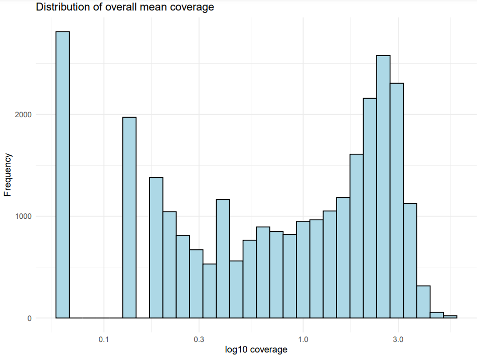

**Figure 1.** Distribution of overall mean gene coverage across all 6 samples. The bimodal shape is typical of RNA-seq: the left peak represents genes with zero or near-zero expression (not transcribed in skeletal muscle), and the right peak represents robustly detected genes. Genes with mean coverage < 10 were filtered out, removing ~49,500 low-signal genes and retaining ~13,600 expressed genes.

---

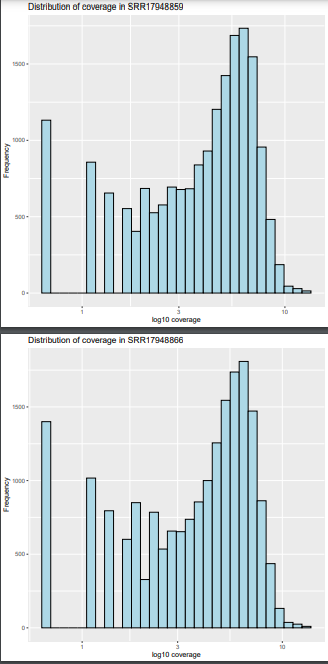 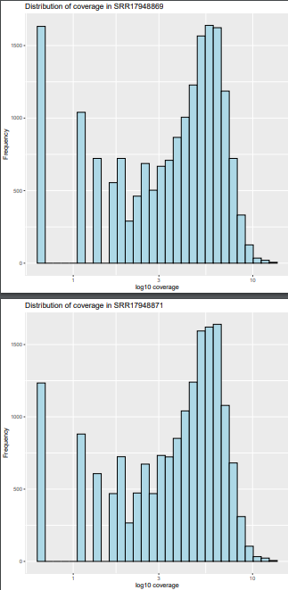

**Figure 2.** Per-sample coverage distributions for T2D (left: SRR17948859, SRR17948866) and Active control (right: SRR17948869, SRR17948871, SRR17948873, SRR17948874) samples. The distributions are highly consistent across samples, indicating uniform sequencing depth.

---

### 1.2 Sample correlation

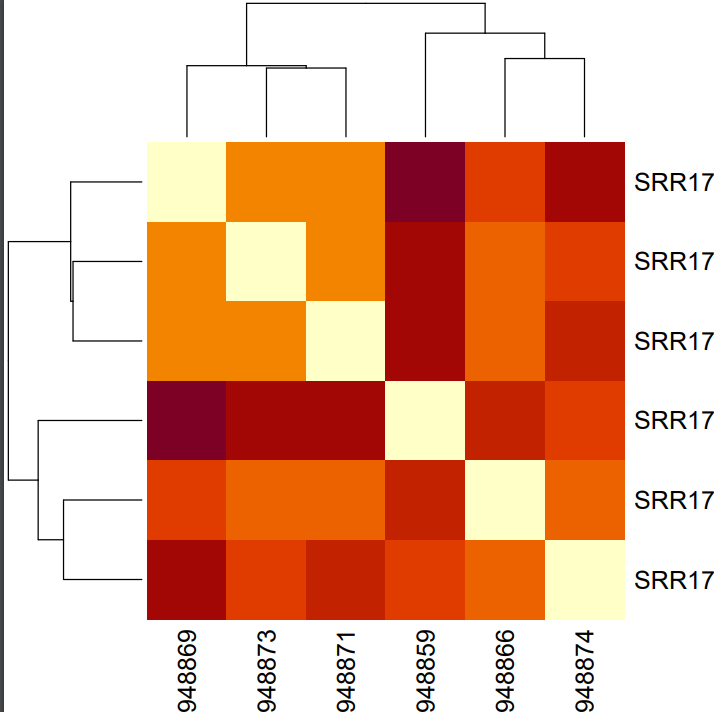 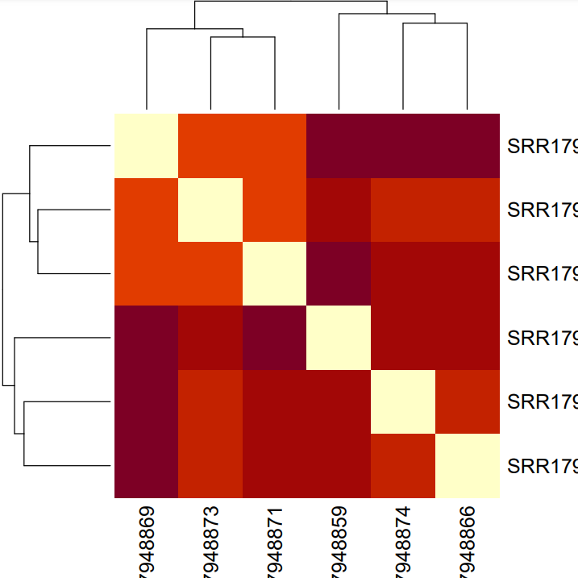

**Figure 3.** Pearson correlation heatmaps — unfiltered (left) vs. filtered (right). Lighter colors = higher correlation. After filtering low-count genes, inter-sample correlation improves and the dendrogram separates Active controls (8869, 8873, 8871) from T2D samples (8859, 8866, 8874).

---

### 1.3 PCA

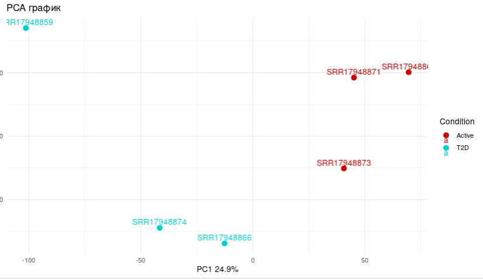

**Figure 4.** PCA on CPM-normalized counts. **PC1 (24.9% variance)** separates T2D (cyan, left) from Active controls (red, right), confirming that the disease state is the dominant source of transcriptional variation. PC2 captures within-group biological variability.

---

### 1.4 Differential expression (DESeq2)

DESeq2 with design `~ group`. Thresholds: **|log2FC| > 1.3, padj < 0.05**.

| Direction | Count |
|-----------|-------|
| Upregulated in T2D | **143** |
| Downregulated in T2D | **90** |
| **Total DEGs** | **233** |

The asymmetry (more up- than downregulated) is consistent with activation of stress-response and inflammatory pathways in insulin-resistant muscle.

---

## 2. RRBS: DNA Methylation Profiling

### 2.1 Preprocessing summary

| Metric | Value |
|--------|-------|
| Trimming | Trim Galore `--rrbs --clip_R1 3 --clip_R2 3` |
| Alignment rate (Bismark) | 63–66% |
| Bisulfite conversion | ~93% |
| CpG context methylation | ~50% |
| Non-CpG methylation | < 1% |
| Genome-wide average | ~7.7% |

---

### 2.2 Methylation distributions

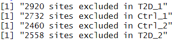 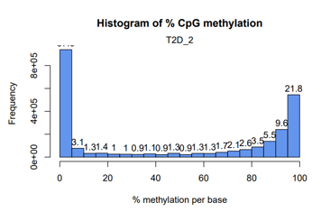

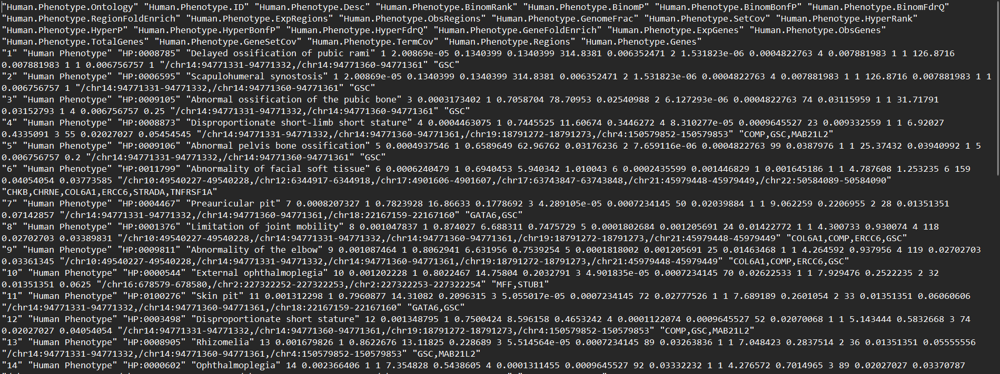 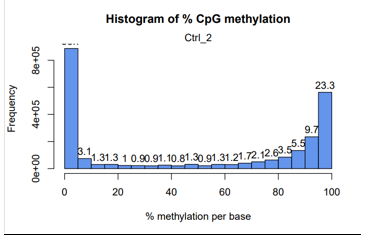

**Figure 5.** CpG methylation distributions for T2D (top) and Control (bottom) samples. The **bimodal pattern** — peaks at 0% and 100% — reflects the binary nature of mammalian CpG methylation: CpGs are typically either fully unmethylated (active promoters, CpG islands) or fully methylated (gene bodies, repeats). Distributions are consistent between T2D and controls.

---

### 2.3 Coverage

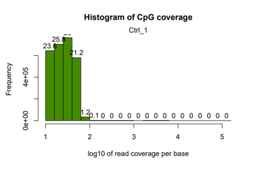

**Figure 6.** CpG coverage distribution. Most CpGs have 10–100x coverage (log10 = 1–2), adequate for reliable methylation calling. Filtering removed < 0.1% of CpGs.

---

### 2.4 Sample concordance

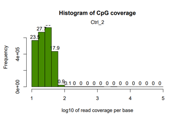

**Figure 7.** Spearman correlation matrix. All pairwise correlations are **0.91–0.92**, indicating highly concordant methylation profiles across the same tissue type.

---

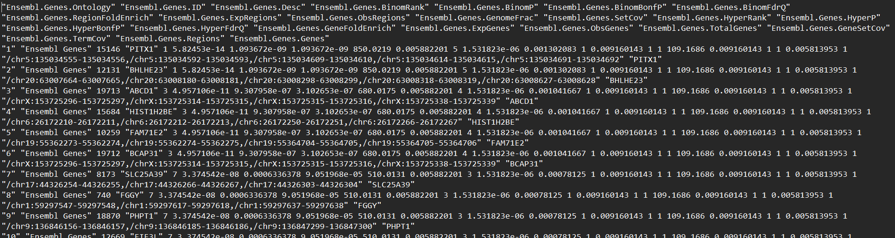 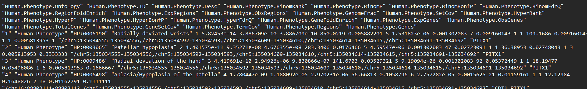

**Figure 8.** Left: Hierarchical clustering (Ward, Euclidean). Right: PCA of methylation data. PCA separates T2D (blue) from controls (red) along PC1, confirming disease-associated methylation differences despite high overall concordance.

---

### 2.5 Differential methylation per chromosome

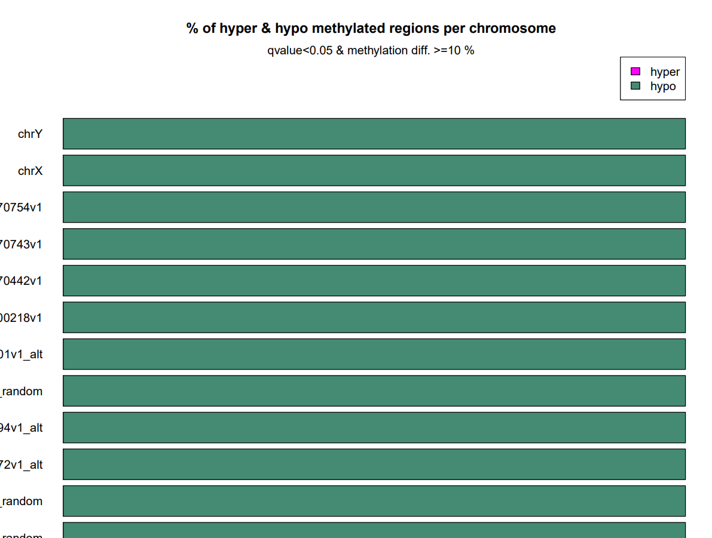

**Figure 9.** Hyper- and hypomethylated CpG positions per chromosome. Standard chromosomes (1–22, X) show 0.5–1% differentially methylated CpGs. Random/alternative contigs show extreme percentages due to small size.

---

### 2.6 Genomic annotation (genomation)

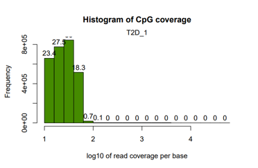

**Figure 10.** DMPs in CpG island context: **81%** fall outside CpG islands ("Other"), **11%** in shores, **9%** within islands. This pattern — disease-associated changes preferentially in shores and open-sea rather than islands — is consistent with metabolic disease methylation studies.

---

## 3. ChIP-seq: RING1 (Polycomb) Binding

### 3.1 IGV visualization (chr10)

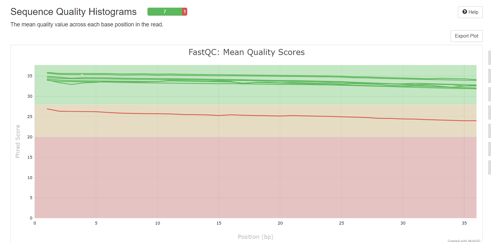

**Figure 11.** IGV session, chromosome 10. Yellow = input controls, blue = RING1 ChIP. Clear enrichment peaks in experimental tracks, absent in inputs. Both **narrow peaks** (TF-like) and **broad peaks** (Polycomb domains) are observed, indicating mixed binding architecture.

---

### 3.2 Peak overlap

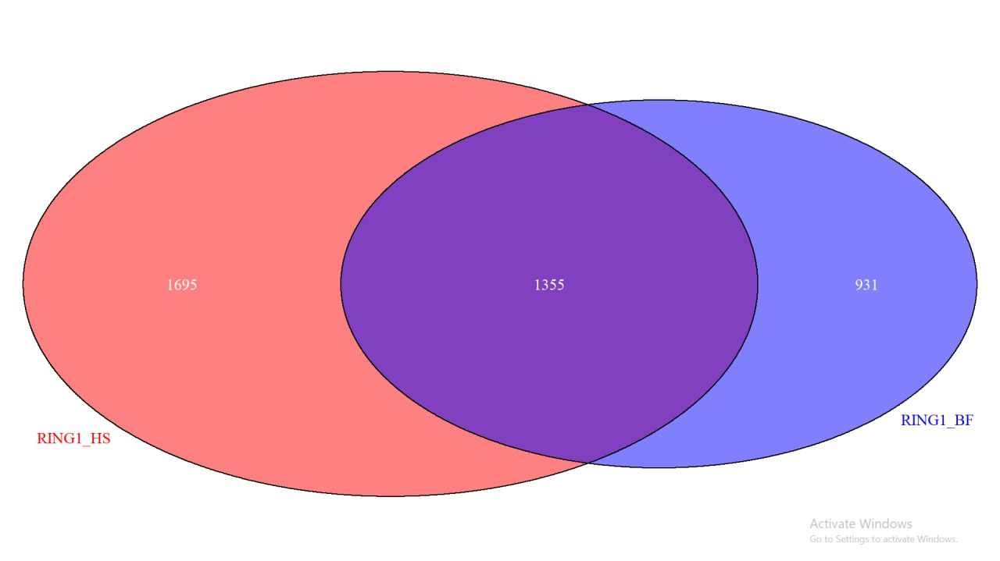 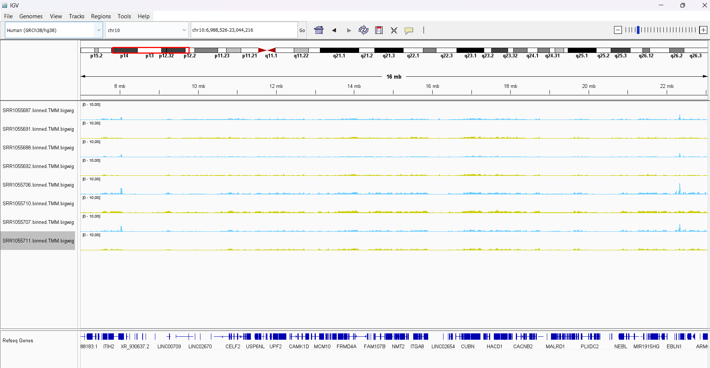

**Figure 12.** Venn diagrams — bedtools intersect (left) vs. macs2 bdgdiff (right). bedtools finds **1,355 common peaks** via coordinate overlap; bdgdiff finds **689** using a statistical model. The ~1,300 shared peaks represent the core RING1 programme conserved across fibroblast lineages.

| Method | BF unique | HS unique | Common |
|--------|-----------|-----------|--------|
| bedtools | 2,286 | 3,050 | 1,355 |
| bdgdiff | 931 | 1,695 | 689 |

---

## 4. Multi-Omics Integration

RNA-seq DEGs (233 genes) were overlapped with RRBS DMPs by matching DMP coordinates to gene bodies. Methylation p-values were aggregated via Stouffer's method.

| Expression | Methylation | Interpretation |
|------------|-------------|----------------|
| **Up** | **Hypo** | Demethylation removes silencing → gene activation |
| **Down** | **Hyper** | Methylation gain → gene silencing |
| Up | Hyper | Discordant (may reflect gene body methylation) |
| Down | Hypo | Discordant (may reflect distal regulatory effects) |

Genes in concordant quadrants (up + hypo, down + hyper) are the strongest candidates for epigenetically driven transcriptional changes in T2D skeletal muscle.

---

## 5. Conclusions

1. **RNA-seq** identified **233 DEGs** (143 up, 90 down) in T2D muscle with clear PCA separation between groups.

2. **RRBS** revealed differentially methylated CpG positions predominantly in **non-CpG-island regions** (81% in open sea, 11% shores), consistent with metabolic disease methylation patterns.

3. **ChIP-seq** mapped RING1/PRC1 binding with **~1,300 shared peaks** across fibroblast lineages and tissue-specific targets with mixed narrow/broad peak architecture.

4. **Integration** of DEGs and DMPs identifies genes with concordant transcriptional and epigenetic changes — priority candidates for T2D functional follow-up.

---

## Methods

| Step | Tool | Parameters |
|------|------|-----------|
| RNA-seq alignment | STAR | `--quantMode GeneCounts`, hg38, ~95% mapped |
| Differential expression | DESeq2 | \|log2FC\| > 1.3, padj < 0.05 |
| RRBS trimming | Trim Galore | `--rrbs --clip_R1 3 --clip_R2 3` |
| Bisulfite alignment | Bismark | Bowtie2, 63–66% mapped |
| Differential methylation | methylKit | delta-beta >= 10%, Hochberg q < 0.05 |
| Genomic annotation | genomation | CpG islands hg38 |
| GO enrichment | rGREAT | basalPlusExt |
| ChIP-seq alignment | Bowtie2 | `--very-sensitive`, hg38 |
| Peak calling | MACS2 | `-f BAM -g hs`, d = 118 bp |
| Peak comparison | bedtools + bdgdiff | intersect / subtract |
| Peak annotation | HOMER | annotatePeaks.pl, findMotifs.pl (len 8) |
